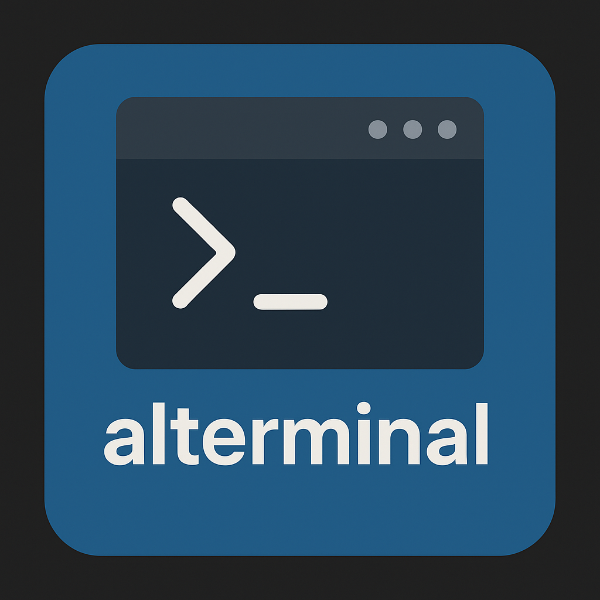

# Alterminal

Advanced terminal interface for VS Code with drag-and-drop panels, command automation, and intelligent session management.

## Features

- **Flexible Panel System**: Drag and drop terminals between primary sidebar, secondary sidebar, and bottom panel
- **Command Automation**: Save frequently used commands for quick launching with one click
- **Smart Session Management**: Terminal sessions persist between VS Code restarts with automatic state restoration
- **Multi-Tab Interface**: Organize multiple terminal sessions in customizable tabs with intelligent titles
- **Drag & Drop Support**: Drop files and text directly into terminals with automatic handling
- **Clickable Links**: URLs and file paths are clickable - file paths open directly in VS Code editor
- **Hardware Acceleration**: WebGL-powered terminal rendering for smooth performance
- **Theme Integration**: Seamlessly matches your VS Code theme colors and appearance

> Architecture / roadmap: See `docs/ARCHITECTURE_REVIEW_2025-08-08.md` for current technical debt, performance plan, and future direction.

## Usage

1. **Access Alterminal**: Click the terminal icon in the Activity Bar or use the Command Palette (`Ctrl+Shift+P` → "Show Alterminal")
2. **Position Anywhere**: Drag the panel to your preferred location - sidebar, secondary sidebar, or bottom panel
3. **Create Terminals**: Use the toolbar buttons to create new terminals or launch saved commands
4. **Save Commands**: Click the save button on any tab to save frequently used commands for quick access
5. **Drag & Drop**: Drop files directly into terminals - they'll be automatically handled based on file type

## Requirements

- VS Code 1.74.0 or higher
- No additional dependencies - Alterminal works with your system's default shell and any installed tools

## Installation

Install from the VS Code Marketplace or install the `.vsix` file directly.

## Contributing

Issues and pull requests welcome on GitHub.

### Known Issues & Future Work

#### Known Issues

- **Terminal state persistence**: When the Alterminal view is closed and reopened, the terminal appears blank until user interaction (though the underlying PTY session persists). A visual redraw mechanism is needed to restore the display state.
- **Cursor positioning**: Cursor may appear offset from correct position after resizing terminal. Force resize to redraw fixes it temporarily.

#### Planned Features

- **Tab Icons & Menus**: Customizable icons for different terminal types with dropdown menus for save/settings/close actions
- **Drag & Drop Tab Reordering**: Allow users to reorder terminal tabs by dragging them to new positions
- **Vertical Tab Layout**: Option for vertical tab arrangement in wide panels
- **Enhanced Process Detection**: Better integration with shell processes for dynamic tab labeling

## Release Notes

### v0.2.1

#### New Features

- **Command Automation**: Save and launch frequently used commands with one click
- **Smart Tab Management**: Enhanced tab titles with process detection and customizable templates
- **Improved Background Handling**: Perfect transparency integration with VS Code themes

#### Bug Fixes

- Fixed canvas background transparency issues
- Resolved text rendering problems with dark themes
- Improved terminal state restoration after VS Code restart

### v0.2.0

#### New Features

- **Drag & Drop Support**: Drop files directly into terminals with automatic handling
- **Clickable Links**: URLs and file paths are now clickable - file paths open directly in VS Code editor
- **Multi-Tab Interface**: Organize multiple terminal sessions with intelligent tab management
- **Hardware Acceleration**: WebGL-powered rendering for smooth performance

#### Performance & Reliability Improvements

- **Better Theme Integration**: Seamless background color matching with VS Code themes
- **Modular Architecture**: Clean separation of concerns with dedicated managers for different features
- **Comprehensive Testing**: Automated test suite ensuring reliability

### v0.1.0

Initial release with core functionality:

- Flexible panel positioning (drag terminals between sidebar, secondary sidebar, and bottom panel)
- Session persistence across VS Code restarts
- Activity Bar integration with terminal icon
